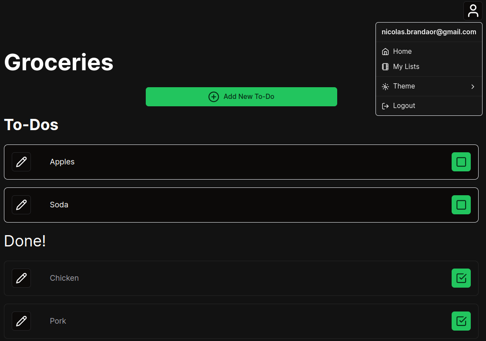

# ✅ ViewTasks Just To-Do it! App
## Description

<div align="center">
  
</div>

[ViewTasks Just To-Do it! app - Watch Demo](https://www.loom.com/share/ad80a2b40ca2477f9072eab38d9128e3)

This is the ViewTasks Just To-Do it! App. It provides a friendly interface to manage to-dos lists, and to-dos within, with global access to your account and to-dos from anywhere.

## Usage

Run the project for development:

```sh
# install dependencies
pnpm i

# start app
pnpm dev
```

Set the env var as the `.env.local.example` file.

## Live

[Visit the app's page](https://viewtasks-beta.vercel.app/)

*Disclaimer: due to infrastructure limitations, the first request to the app might take a little longer (backend startup/waking up time)*

## Technical Description

This application is built using the following technologies:

- **Next.js 14.2:** Next.js provides server-side rendering and other powerful features for building React applications. Version 14.2 introduces enhancements and bug fixes for a smoother development experience.

- **Tailwind CSS:** Tailwind CSS is utilized for rapidly building custom user interfaces with its utility-first approach, allowing for easy styling and responsiveness.

- **ShadCN Components:** We leverage ShadCN Components to enhance the UI with pre-built, customizable components, streamlining development and ensuring consistency in design.

- **React Hook Forms and Zod:** Form handling is accomplished using React Hook Forms for efficient form management and validation, while Zod provides schema validation for ensuring data integrity.

- **useContext for Global State Management:** Global state management is facilitated through React's useContext hook, allowing for centralized state management across components.

- **JWT Authentication:** JWT tokens received from the backend are securely stored in cookies and served as authorization headers on HTTP requests to the backend API, ensuring secure authentication and authorization.

Additionally, the application takes advantage of advanced configurations for proxying requests and middleware to manipulate incoming requests for optimized server-client communication.

Special Next.js files such as `loading.js` and `not-found.js` are utilized to enhance the user experience and handle loading states and 404 errors seamlessly.


### Contexts

#### Tasks List and Tasks Context Providers (tasksLists.tsx and tasks.tsx):

These files contain the implementation of a React context provider for managing tasks lists and tasks within the application. Below is a brief overview of the key features and functionalities:

- **Context Provider Setup:** The files set up context providers using React's `createContext` and `useReducer` hooks to manage the state of tasks lists and tasks within the application.

- **State Management:** The state of tasks is managed using a reducer function `reducer` along with initial state `initialState`. The state includes the tasks lists, tasks, current status (idle, loading, failed), and error messages if any.

- **Actions:** Various actions are defined to interact with tasks, including fetching, creating, editing, and deleting tasks lists. These actions are defined within the `Actions` type and implemented as async functions that dispatch corresponding actions to the reducer based on the action type.

- **Contexts:** Two types of contexts are created - `StateContext` and `ActionContext`. `StateContext` provides access to the state of tasks, while `ActionContext` provides access to the actions for interacting with tasks.

- **Custom Hooks:** Custom hooks, like `useTasksList` or `useTasksActions`, are provided for conveniently accessing the tasks state and actions within functional components.

- **Providing:** These contexts providers wrap the root layout with the `TasksListProvider` and `TasksProvider` and provide the custom hooks and contexts to components and page within.

### middleware.ts

The file `middleware.js` contains middleware logic for handling API requests in a Next.js application. Below is a summary of its functionality:

- **Middleware Function:** The `middleware` function intercepts incoming requests (`req`) and performs certain checks and modifications before passing them to the next middleware or route handler. 

  - If the request URL includes "/auth" or "/users", the middleware proceeds to the next middleware or route handler using `NextResponse.next()`.
  - Otherwise, it checks if there is an access token stored in the request cookies. If no access token is found, the middleware redirects the user to the login page.
  - If an access token is present, it adds an Authorization header to the request using the token.
  
- **Config:** The `config` object specifies the configuration for the middleware, including the URL matcher. In this case, the middleware is configured to be applied to all requests under the "/api/:path*" path.

This middleware ensures that API requests are properly authenticated with an access token before being processed, enhancing the security and integrity of the application's API endpoints.

### Proxy Configuration

The file `next.config.js` contains configuration settings for rewriting incoming requests in a Next.js application to proxy them to a backend API. Below is a summary of its functionality:

- **Rewrites Function:** The `rewrites` function is an asynchronous function that returns an array of rewrite rules. Each rule specifies how incoming requests should be rewritten or redirected.

  - In this configuration, there is a single rewrite rule defined to handle requests to "/api/:path*". 
    - **Source:** Requests matching the pattern "/api/:path*" are intercepted.
    - **Destination:** These requests are rewritten to the backend API URL specified by the environment variable `NEXT_PUBLIC_API_URL`, with the original path appended.

- **Environment Variable:** The backend API URL is dynamically retrieved from the environment variable `NEXT_PUBLIC_API_URL` and used as the destination for the rewritten requests.

- **Logging:** The paths being rewritten are logged to the console for debugging or monitoring purposes.

This configuration enables the Next.js application to act as a proxy for requests to the backend API, ensuring that requests to specific endpoints are transparently forwarded to the appropriate backend services.


### Tech Stack

- **Next.js 14.2**: React framework for building server-side rendered and statically generated web applications.
- **Tailwind CSS**: A utility-first CSS framework for creating custom designs with minimal CSS.
- **react-hook-form**: Library for managing forms in React applications with a focus on performance and ease of use.
- **cookies-next**: Library for handling cookies in Next.js applications.
- **next-themes**: Library for adding theme support to Next.js applications.
- **ShadCN**: UI components collection.
- **zod**: VTypeScript-first schema declaration and validation library.

### Improvements / Next Steps

- Http only cookies
- Auth Context
- Animations with Framer Motion
- More reponsiviness breakpoints
- Edit Account/Profile

### References

- [Next.js](https://nextjs.org/docs)
- [Tailwind CSS](https://tailwindcss.com/)
- [React Hook Form](https://react-hook-form.com/)
- [Cookies Next](https://github.com/andreizanik/cookies-next)
- [Next Themes](https://github.com/pacocoursey/next-themes)
- [Shadcn UI](https://ui.shadcn.com/)
- [Zod](https://zod.dev/)

